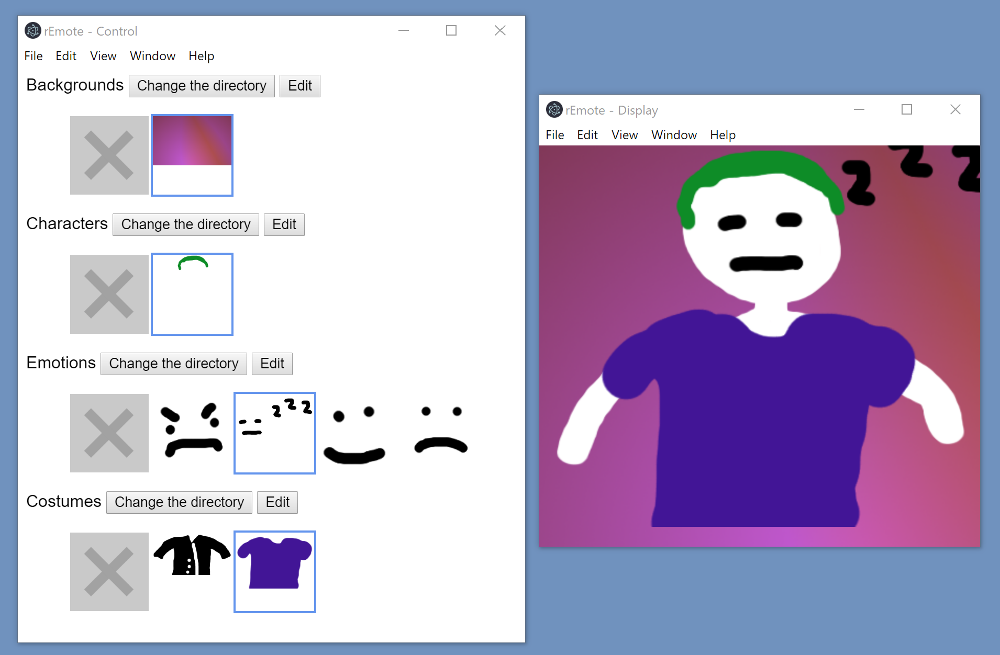

# rEmote

This is an electron desktop app to dynamically display layered images, designed to be used in a live game streaming context.

## TODO

- add 'confirm exit?' dialog box, at least if in edit mode
- refactor to follow a more mvc like pattern
- auto update https://electronjs.org/docs/tutorial/updates

### Control Window

- lock all ctrl window buttons when in edit mode
- mouse-over animation to indicate 'clickable'
- image title attributes to show info e.g. filename, dimensions
- visual indicator, decorator, whether image has been edited
- option to re-show display window if (accidentally) closed
- make gui look like wireframe, UI aesthetic overhaul, use library? e.g. materialize? bootstrap?

### Display Window

- fix flipping image when changing
- fix mouse over area for resize handle (it's too small now)
- only show options bar (file edit etc) during edit mode (it is visible in slobs)
- resize from upper left as well
- refine UI of x,y,height display in edit mode (e.g. status bar at bottom)
- make little resize box more easily clickable

## DONE

- click a button, png appears in display
- move display to other window (could start here)
- click one of many buttons, corresponding png appears in display
- have image sets, background, character, costume and emotions
- buttons are made for each file in directory
- image layering (bg, char base, clothes, emotion, back to front respectively)
- make a settings.json file that persists image directory locations
- set image directory
- persist directory locations
- no scroll bars in display window
- animated gifs
- persist new size and position
- costume layer above emotion layer
- should be resizeable, keep aspect ratio? or not to remove bleed?
- bounding box behind edit buttons
- make buttons thumbnails
- when in edit mode, clicking 'reset' should also move bounding box
- "None" option for emotion and costume layer, disables Edit btn when selected